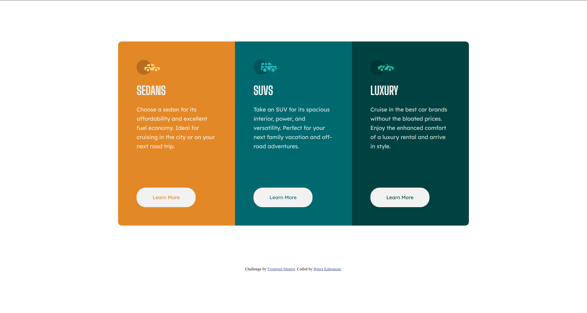
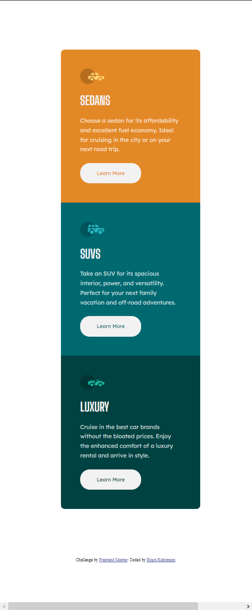

# Frontend Mentor - 3-column preview card component solution

My solution to the [3-column preview card component challenge on Frontend Mentor](https://www.frontendmentor.io/challenges/3column-preview-card-component-pH92eAR2-).

## Table of contents

- [Overview](#overview)
  - [The challenge](#the-challenge)
  - [Screenshot](#screenshot)
- [My process](#my-process)
  - [Built with](#built-with)
  - [What I learned](#what-i-learned)
  - [Continued development](#continued-development)
- [Author](#author)

## Overview

### The challenge

Users should be able to:

- View the optimal layout depending on their device's screen size
- See hover states for interactive elements

### Screenshot

Desktop View:

Mobile View:

## My process

### Built with

- Semantic HTML5 markup
- CSS custom properties
- SASS
- Flexbox
- CSS Grid

## What I Learned

In the process of completing this project, I had the opportunity to expand my skills and knowledge in several key areas. Here are some of the key takeaways from this experience:

### 1. **SASS Mastery**

This project marked my first hands-on experience with SASS (Syntactically Awesome Style Sheets). Through using SASS, I discovered the power of variables, nesting, and mixins, which greatly enhanced the organization and efficiency of my stylesheets. The ability to modularize my code and maintain a more structured approach to styling was a significant revelation.

### 2. **Grid Utilization**

While I had previously worked with CSS grid layouts, this project allowed me to reinforce and deepen my understanding of this powerful layout tool. I found myself leveraging the grid system to seamlessly position the three card components side by side. The flexibility and control that CSS grid provides proved instrumental in achieving the desired layout while maintaining responsiveness.

### 3. **Responsive Design with Media Queries**

Although not my first time using media queries, this project reinforced the importance of responsive design. By implementing media queries, I ensured that the card components gracefully adapted to various screen sizes. This practice enhanced the user experience, as the content remained easily accessible and visually appealing across a range of devices.

### 4. **Component Creation and Styling**

The main objective of this project was to create and style three distinct card components. This allowed me to delve into the principles of component-based design, fostering a modular approach to development. I gained insights into structuring components for reusability, making maintenance and future expansions more streamlined.

### 5. **Collaboration and Problem Solving**

Throughout this project, I encountered various challenges that required creative problem-solving. Engaging with new concepts like SASS, optimizing grid layouts, and ensuring responsiveness demanded a combination of research and experimentation. This experience cultivated my ability to tackle unfamiliar problems head-on and taught me the importance of tenacity in achieving desired outcomes.

In conclusion, this project has been an invaluable learning journey. From delving into SASS and mastering grid layouts to refining my skills with media queries, I've gained practical insights that will undoubtedly enhance my future design and development endeavors. The successful creation and styling of the three adjacent card components have not only improved my technical proficiency but also bolstered my confidence in taking on more complex projects in the future.

## Continued Development

As I reflect on the completion of this project, I recognize several areas that I aim to further develop and refine in my future projects. These focal points will contribute to my growth as a developer and enhance the quality of my work:

### 1. **Advanced SASS Techniques**

While I successfully integrated SASS into this project, I acknowledge that there are more advanced techniques and features within the SASS ecosystem that I have yet to explore fully. I plan to delve deeper into mixins, functions, and other advanced SASS capabilities to streamline my stylesheets and make them even more modular and maintainable.

### 2. **Mastering CSS Grid Layouts**

Though I effectively employed CSS grid to structure the layout in this project, there's always room for improvement. I intend to refine my understanding of grid layout techniques, such as using named grid areas and managing complex grid structures efficiently. By mastering these techniques, I will be better equipped to create versatile and responsive layouts for a variety of design scenarios.

### 3. **Responsive Design Strategies**

While I utilized media queries to ensure responsiveness, I recognize that there's always more to learn when it comes to crafting seamless and optimized user experiences across a wide range of devices. I aim to explore more advanced responsive design strategies, such as fluid typography and using viewport units effectively, to ensure that my designs adapt flawlessly to different screen sizes.

### 4. **Design Systems and Component Libraries**

In future projects, I aspire to build upon the concept of modular components. Creating a comprehensive design system or a reusable component library will allow me to accelerate development, maintain a consistent visual identity, and facilitate collaboration with other developers. I look forward to honing my skills in designing and implementing scalable design systems.

In conclusion, my journey doesn't end here; it's just the beginning. With an unwavering commitment to mastering SASS, deepening my understanding of grid layouts, and exploring advanced styling techniques, I'm excited to tackle future projects with increased confidence and expertise. By continually pushing my boundaries and embracing new challenges, I'm confident that I will achieve my goal of becoming a proficient and versatile front-end developer.

## Author

- Website - [Büşra Kahraman](https://busrakahraman.github.io/Portfolio/)
- Frontend Mentor - [@BusraKahraman](https://www.frontendmentor.io/profile/BusraKahraman)
